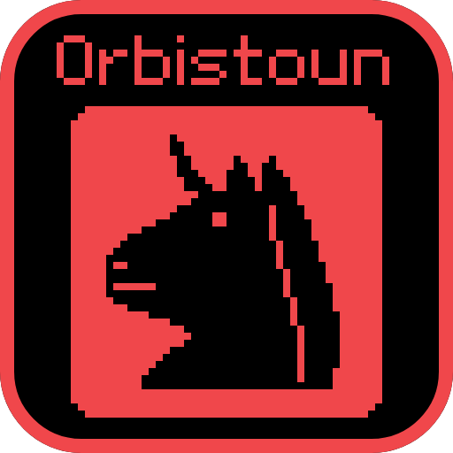

<p align="center">
  
</p>

# orbistoun

A high-level emulator for Prospero-generation hardware, in Rust. A research project.

Site + API docs: **[project-oops.github.io/Orbistoun](https://project-oops.github.io/Orbistoun/)**

> **Status: pre-alpha, renders nothing.** Every commercial executable in the local
> corpus loads, links, and **executes real guest code** - one of them for ninety-nine
> million system calls before the time limit stops it. None produces a pixel, and no
> guest has yet spawned a thread. No emulator for this target boots a commercial title
> today, and this one is younger than the rest.

## About

orbistoun is a **high-level emulator**: the guest CPU is x86-64 and so is yours, so
guest code runs natively with no translation. The work is elsewhere - reimplementing
the target operating system underneath it, and translating its GPU command streams
to Vulkan.

Three properties shape everything here:

- **No firmware required.** The vendor system libraries are reimplemented, not
  loaded. A build needs nothing from the hardware to run.
- **Interception is linking.** Guest modules import by NID hash; orbistoun resolves
  those hashes and *is* the linker. That means the complete list of what a title
  needs is available statically, before a single guest instruction executes.
- **Stub behaviour is data.** What an unimplemented function returns to the guest
  is a TOML file you edit, not a recompile - because it is usually unknown, and
  bisecting it should cost a relaunch.

## Getting started

**The recommended way in is [OOPS](https://github.com/project-oops/OOPS)**, which holds all four
side by side and carries one entry point over them:

```bash
./bin/oops check orbistoun    # also: build, test, fmt, clean
```

That relays to this repository's own entry point rather than reimplementing anything, so the
two cannot disagree - and it is what CI runs, for the same reason.
[docs/BUILDING.md](https://github.com/project-oops/OOPS/blob/main/docs/BUILDING.md) has every verb.

**From inside this repository the entry point is `bin/orbistoun`**, carrying the seven verbs
every OOPS project has - `build`, `test`, `lint`, `fmt`, `check`, `clean`, `doc` - and far
more besides, because the emulator's own loop lives in it:

```bash
./bin/orbistoun doctor --fix   # is this machine ready; --fix installs what is missing
./bin/orbistoun check          # is the tree sound
./bin/orbistoun run <title>    # one turn of the actual work
```

`./bin/orbistoun --help` lists the rest, and **[docs/BUILDING.md](docs/BUILDING.md) is the
full account**: what each verb does, what `check` runs and in what order, and what CI runs.

That last command is the project. It resolves a title, refreshes symbol names if they
are stale, runs the guest under a time limit, and reports what it asked for, how far it
got, and **whether that is further than last time**.

**A clone of only this repository is not enough.** Orbistoun takes four crates from
`oops-libs` by relative path, as a sibling, so the collection layout is a build requirement.
`oops bootstrap orbistoun` fetches it.

**[docs/THE_LOOP.md](docs/THE_LOOP.md) is the one-page explanation of what that loop
does**, start to finish, including which steps still need a person. New contributors
should start there.

With no titles on disk, everything below still works and says what it cannot do:

| Command | What it does |
|---------|--------------|
| `orbistoun-cli symbols` | Every system-library function orbistoun declares |
| `orbistoun-cli knows` | What is recorded about those functions, and what it rests on |
| `orbistoun-cli questions` | Everything written down that this project does **not** know, ranked |
| `orbistoun-cli worklist` | What to implement next, totalled across every run so far |
| `orbistoun-cli compat list` | How far each title has got, furthest first |
| `orbistoun-cli imports <file>` | What a guest module needs, without executing it |
| `orbistoun-cli policy` | Emit a default stub-policy file to edit |

`imports` reports an honest error rather than an empty list when a container cannot be
parsed. An empty import list would read as "this title needs nothing", which is never
true.

## Where it actually is

All six executables in the local corpus run guest code. That one is measured from a run,
on material this repository does not ship, so it is not in the generated table below - which
holds only what the tool can recompute anywhere.

<!-- generated by `orbistoun-cli status` - do not edit by hand -->

| | |
|---|---|
| Functions declared / implemented | 374 / 332 |
| Recorded behaviours | 342 - 189 published, 6 measured, 35 guest-observed, 112 assumed |
| Open questions a hardware probe could settle | 302 |
| Symbol database | 30086 names - 630 from this repository, 29439 from this repository and the module, 17 from this repository and a run of the module, 0 unaccounted |

<!-- end generated -->

Unflattering detail, including the three current walls, is in
[docs/PROJECT_STATUS.md](docs/PROJECT_STATUS.md). The number that matters is the share
of calls answered by a real implementation, not a screenshot.

## Layout and scope

The workspace is a dependency spine - each crate required by everything after it, which is also
the build order. What each crate is for: **[docs/CRATES.md](docs/CRATES.md)**.

What orbistoun deliberately **is not**, so that "should we add X?" has an answer already
written down: **[docs/SCOPE.md](docs/SCOPE.md)**.

## Documentation

Start at the **[documentation hub](docs/README.md)**, or go straight to
**[docs/THE_LOOP.md](docs/THE_LOOP.md)** for what the tool actually does. Contributors:
build principles and conventions are in [CLAUDE.md](CLAUDE.md); every decision and its
reasoning is in [docs/DECISIONS.md](docs/DECISIONS.md).

Work that informed this project is credited in
[ACKNOWLEDGEMENTS.md](ACKNOWLEDGEMENTS.md). Reference only - nothing here is lifted.

## Licence

Dual-licensed under [MIT](LICENSE-MIT) or [Apache-2.0](LICENSE-APACHE), at your
option - the Rust ecosystem convention.

## Part of OOPS

Orbistoun is one of four projects aimed at the same platform's operating system. They are developed
together in **[OOPS](https://github.com/project-oops/OOPS)** and released separately.

| | |
|---|---|
| **[obSCEne](https://github.com/project-oops/obSCEne)** | the probe - a guest that interrogates whatever runs it and reports what it found |
| **[Prosperous](https://github.com/project-oops/Prosperous)** | the instrument - remote management for anything that runs Orbis software |
| **[SELFish](https://github.com/project-oops/SELFish)** | the formats - read, write and build tools for the platform's own file formats |

**Developing any of them?** Clone [OOPS](https://github.com/project-oops/OOPS) - it holds all four side by side, arranged so
they build against each other. Cloning this repository alone gets you this project; it is
the right thing for using it and the wrong thing for changing it.

Shared rules - provenance, naming, decision logs, worklogs, gates - live in
[the OOPS conventions](https://github.com/project-oops/OOPS/blob/main/docs/CONVENTIONS.md) and are not restated here.
