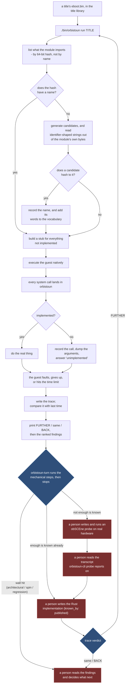
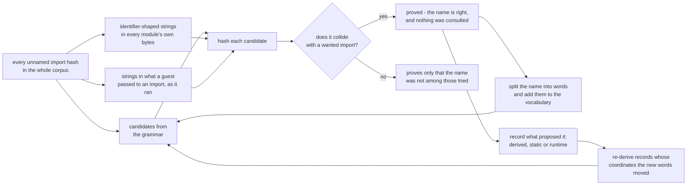
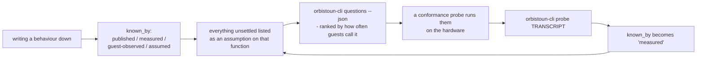

# The loop

One turn of orbistoun's work, start to finish: what each step does and who performs it.
[WORKFLOW.md](WORKFLOW.md) is the command reference - what to type, with which flags.

Every design choice in this repository exists to make one turn cheap, or to make its output
worth reading.

## Overview



Naming, stub-building, execution, tracing, the progress verdict and the mechanical sweeps of
`orbistoun-turn` run unattended. Deciding what a finding means and writing the implementation
are a person's job. Nothing in this repository dispatches a hardware probe, drives obSCEne or
Prosperous, or writes Rust from a measurement: [orbistoun-probe](../crates/orbistoun-probe/README.md)
only reads a transcript, and [orbistoun-propose](../crates/orbistoun-propose/README.md) has no
implementation proposer.

## The first rule: the title is not the bug

Every title the operator provides runs on real hardware, so every wall is orbistoun's
(D708). "Debug build", "devkit path", "faithful `ENOENT`" and "the title's own assertion" are
restatements of a symptom orbistoun has not explained, never reasons to stop.

Before instrumenting a fault, check the upstream fact it rests on. A guest that faults after
a failed `open` failed because orbistoun misrouted the path or did not serve the mount, until
the file is shown absent from the place the run reads: the resolved data directory, which
`orbistoun-cli paths` prints.

## Steps

### Once

1. A title's directory goes into the title library - the one shared `titles/` under the data
   directory that every OOPS tool reads, outside this repository.

### Every turn

2. `./bin/orbistoun run <title-id>` rebuilds, refreshes names if they are stale, runs the
   guest under a time limit, and reports.
3. orbistoun parses the container and lists every system function the module imports.
4. The imports are 64-bit hashes rather than names, because that is how the guest links, so
   each is looked up in the symbol database.
5. For hashes nothing names, the name search generates candidates from a grammar and reads
   identifier-shaped strings out of the module's own bytes.
6. A candidate is accepted only when it hashes to the import. The hash is the proof, so a
   reported name is never a guess (see [PROVENANCE.md](PROVENANCE.md)).
7. A confirmed name is written to `symbols/generated.json` and its words join the vocabulary,
   so the next module needs less searching.
8. orbistoun builds a stub for every declared function it does not implement, from the stub
   policy. The policy is data: changing an answer costs a relaunch, not a rebuild.
9. The ELF loader reserves the address space, places the module, resolves imports, applies
   relocations, sets up TLS and jumps to the entry point.
10. The guest's machine code executes natively - same architecture, no translation - until it
    calls out.
11. Every call to a system function lands in orbistoun instead of the platform's operating
    system.
12. Implemented functions do the real work. Unimplemented ones record the call, dump the
    arguments and answer "unimplemented".
13. The guest faults, exits, or reaches the time limit or call budget. All of these are
    results, and each writes a trace.
14. The trace is written to disk keyed by module, so a sweep leaves one per title.
15. The trace is compared with the previous one for the same module, giving `FURTHER`, `same`
    or `BACK`.
16. The findings are printed, ranked worst first: what went wrong, the evidence, and what to
    do about it.
17. A person reads the top finding. `orbistoun-turn` has already run the mechanical sweeps
    against it. If what is left is an unmeasured interface or structure, the next step is a
    hardware probe question rather than a guess.
18. A person writes the implementation - from a published source, or from what an obSCEne
    probe measured on the hardware - and tags it with its `known_by`.
19. Go to step 2. `FURTHER` keeps the change; `same` or `BACK` does not.

## Who does what

| Step | Who | Automatic |
|---|---|---|
| 2 - run | a person types one command | yes |
| 3-4 - imports, name lookup | orbistoun | yes |
| 5-7 - name search, vocabulary widening | orbistoun | yes |
| 8 - stubs | orbistoun | yes |
| 9-12 - load, execute, intercept, dump | orbistoun | yes |
| 13-14 - a trace on every outcome, including a spinning guest | orbistoun | yes |
| 15 - progress verdict | orbistoun | yes |
| 16 - ranked findings | orbistoun | yes |
| 17 - mechanical sweeps (`orbistoun-turn`) | orbistoun | yes |
| 17 - interpret a finding, design a probe | a person | no |
| 17 - write and run an obSCEne probe on the hardware | a person, via `pros` | no; `orbistoun-cli probe` reads the transcript afterwards |
| 18 - write the implementation | a person | no |
| record what a function must answer | orbistoun, into `learned.toml` | yes |
| record what was learned by hand | a person, via `learn` | no, deliberately |
| record what the title reached | `compat record`, prompted by the run | prompted |

## Step 17: the dispatcher

`orbistoun-turn` maps each kind of finding the report names to a fixed next step and runs the
ones that are mechanical: the argument sweep, the other diagnostic axes, a watchpoint, a naming
attempt, a region handed to the guest when a sweep shows one missing. It stops at the steps
that are a person's, each with a sentence saying why.

It is a dispatcher, not a chooser. A boot against a wall costs a fraction of a second and a
model's answer costs several seconds, so running every candidate experiment is cheaper than
choosing between them (D231).

The argument sweep is two-dimensional. It crosses a planted sentinel with what the call is
forced to return, because a guest may check the return before it reads the out-parameter, and
then neither intervention alone changes anything (D286). It hands back a slot, an offset and
the condition it holds under.

A fault on a computed address composes two diagnostics, neither of which reads the guest's
code (D276):

```
fault at an address the guest computed
  -> snapshot the structure it was computed from   (which words are still zero?)
  -> arm up to four of those words                 (who reads them, and from where?)
  -> a named instruction offset, in a named region
```

The result is an instruction offset, which is a finding; what should have filled the slot is
step 18. The variables behind both are in [WORKFLOW.md](WORKFLOW.md#diagnostics).

## Step 18: the implementation

Nothing here writes an implementation. Each one carries a decision - what to leave in the
caller's buffer, whether to trust a number the guest supplied, whether refusing beats guessing.

A generated implementation is admissible only as a proposal a person reads, gates and merges.
It arrives as an inert patch in a submission, carries an oracle like every other fact, and is
merged only by somebody willing to say where the behaviour came from (D322). See
[TESTING.md](TESTING.md).

## Walls

There is no separate escape mechanism. A wall is handled by the same verdict and findings:

- A guest that never calls out and never faults is bounded by the time limit and the call
  budget, and the exit status says which one stopped it (D238).
- A regression prints `verdict: BACK`. Nothing reverts a change automatically; keeping or
  discarding it is the author's decision.
- An architectural gap - an undecoded GPU packet, a shader instruction the translator does not
  handle - appears as a stub or a refusal in the trace and is worked like any other finding.

## Reading a turn's output

```text
orbistoun: guest fault: write to 0xfffe0 while executing at 0x400000afc959 (image+0xafc959)
reached    ContainerParsed
reached    ImportsResolved
reached    Mapped
reached    Linked
reached    Entered
outcome    Crashed { signal: "access violation - the guest dereferenced unmapped memory" }

progress
  imports  23 distinct (+0), 222 calls (+0)
  standing 213 of 222 calls answered by an implementation (4% on stubs)
  fault    image+0xafc959
  verdict  same     nothing moved
  abi      222 calls, all on a conforming stack
  faulted  write to 0xfffe0
           rax=0x0 rcx=0xfffe0 rdx=0x100000 rdi=0x4000019e9ca0
           called from 0x400000f5778a <- 0x400000000064 <- 0x4000000000a2

what to do about it
  ! the guest faulted at image+0xafc959, write to 0xfffe0
      write to 0xfffe0 is an address in no region this run mapped
      rax=0x0 rcx=0xfffe0 rdx=0x100000 rdi=0x4000019e9ca0
      just before: libkernel::0x6abac2f3dc6f8cee(0x600000800d38) from 0x400001595d8b
    -> read the calls just before it and the arguments they were given - the value
       that became this address was answered by one of them
  ! libkernel::0xd652cde431670c7e was called 2 times and has no name
      arg0 = 0x7
      arg3 = 0x400001aa8d28 -> image+0x1aa8d28 = 00 00 00 00 00 00 00 00 ...
    -> extend the candidate vocabulary and re-run the name search
```

- `verdict` - `FURTHER` means the guest executed code it could not reach before; it is the
  measure of progress. `BACK` means a regression. `same` on an unchanged tree is expected, and
  that stability is what makes any movement attributable.
- `standing` - the share of calls answered by a real implementation. A raw call count rises
  when stubs answer wrongly, so it rewards the wrong thing (D181).
- `faulted` - the operation, address, registers and call path of the fault.
- Argument dumps under an unnamed import carry scalars as well as pointees, because a value
  passed in a register points at nothing (D179).

Every finding ends in an arrow saying what to do. A finding without one is a defect in
`orbistoun-report::diagnose`.

| What you see | What it means | What to do |
|---|---|---|
| A name at the top of the worklist with an enormous count | A guest spinning on it | Implement it; this is the wall |
| `library::0x...` at the top | The same, not yet named | Extend `crates/orbistoun-names/data/vendor.toml`, re-run |
| A fault instead of a time-out | The guest got somewhere and died | Read the `faulted` block and the calls just before it |
| Many calls spread thinly | The guest is progressing | Implement the frequent ones and go again |
| `standing` fell while `calls` rose | A stub started answering wrongly | Check what the new answers unlocked before believing the progress |

## The naming sub-loop

Naming is the part of the loop that gets cheaper as it runs.



A hash is one-way, so the only method is to propose a name and let the hash accept or refuse
it. A hit is proof rather than a lookup, which keeps the symbol database clean-room. Every
source is confirmed the same way; the record says which source proposed the name, and the
audit tiers sources by what somebody else needs to repeat them (D213).

The search runs over the whole corpus, not one module at a time: one module's strings name
another module's imports, and the vendor C library module carries names that titles import
without ever spelling them.

Two edges feed back into the grammar:

- Vocabulary: a name learned from one title teaches the generator words that reach hashes in
  unrelated titles.
- Repair: a generated record cites a pattern and an index into an enumeration over the
  vocabularies, so every learned word renumbers the candidates built from it. `audit --repair`
  re-derives the records the new words moved.

### A model as a vocabulary source

A miss proves only "not in what was tried", so naming more imports needs more words. Words
come from the modules, from published standards, and from `orbistoun-propose::vocabulary`,
which asks a local model for words one grammar position at a time.

Nothing a model says is trusted: it proposes words and the hash decides. A wrong suggestion
costs a sweep and vanishes, which is why a model may guess here and nowhere else in this
project. Words are banked only when a confirmed name was built from them, and promoting a
banked word into `vendor.toml` is a separate, deliberate act. The yield sits in the first
round of each position; ask once per position.

## The questions sub-loop

Some facts cannot be settled by watching a guest: what a function returns on the hardware
when nothing observes the return, or what an argument means when every observed call passes
the same value. These are measurements to be taken.



`known_by` has no value meaning "already known": every option names something that could
contradict it. `assumed` is a normal state. A written-down assumption can be counted, ranked,
probed and retired.

### Probing on the hardware

Three components share step E:

- obSCEne is the instrument. It runs on the hardware and answers a question over a command
  protocol, so a new question costs a round trip rather than a rebuild.
- Prosperous delivers and supervises it. A probe calling functions of unknown arity faults as
  its normal case, so `pros supervise` re-sends it when it stops answering:

  ```bash
  pros send obscene.module.elf     # onto the hardware, through the loader
  pros supervise obscene.elf       # re-send it whenever it stops answering
  pros logs                        # the report, as it comes out over the kernel log
  ```

  `supervise` refuses to send while the probe answers, and gives up after three consecutive
  dead starts. Every session carries an identifier, so a restart is visible and nothing is
  resumed across it.
- A person starts the loader on the hardware after a power cycle, and decides the hardware is
  free: a faulting call takes down whatever was running.

## Checkout and binary

The loop does not need this repository. Somebody running a release binary against a title
nobody here owns turns the same oracle - the guest itself - and what they produce is worth
collecting (D297).

| Artifact | Where it lands | Needs a checkout | Sendable |
|---|---|---|---|
| `learned.toml` measurements | data directory | no | yes |
| compat entries | `--dir`, default `./compat` | no | yes |
| traces, run reports | data directory | no | no - they are inputs |
| `symbols/generated.json` | the repository | yes | via the name, not the file |
| an implementation | the repository | yes | as a patch |

Everything sendable is the same kind of claim: derived from running a binary the submitter
owns, reproducible by anyone with the same title, and falsifiable by a command. A maintainer
without the title cannot check a diff, but can accept a measurement as `assumed` and promote
it when somebody who owns the title confirms it. `submit export` and `submit check` gather and
receive these; see [WORKFLOW.md](WORKFLOW.md#recording-what-a-turn-produced).

## Properties of the loop

- Step 7 compounds: naming is not per-title work, and every learned name is vocabulary for
  every later title.
- Step 16 removes diagnosis, not fixing: the run states the wall, with evidence, ranked.
- The loop never keeps unverified code: step 18 is a person's, and a change is kept only when
  the re-run says `FURTHER`.
