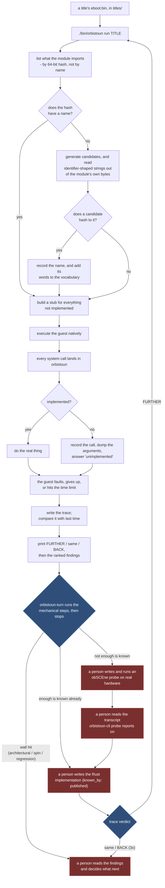
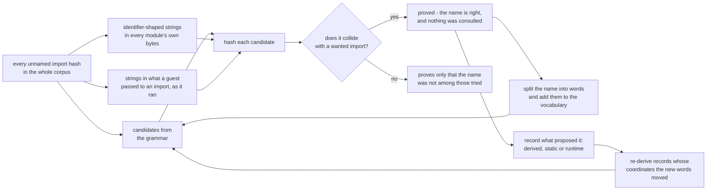

# The loop

**What actually happens, start to finish, in one-sentence steps.**

[WORKFLOW.md](WORKFLOW.md) is the command reference - what to type, in what order, how
often. This page is the thing underneath it: the cycle those commands turn, what each
step does, and - the part worth being blunt about - **which steps a person still has to
do**.

Every design decision in this repository exists to make one turn of this loop cheap, or
to make its output worth reading. If something here cannot be traced back to that, it
should not be here.

## The short version



The mechanical part of the loop - naming, stub-building, execution, tracing, the progress
verdict, and the sweeps `orbistoun-turn` can run without reading the guest's code - runs
unattended. **Deciding what a finding means and writing the implementation is a person's
job throughout**, not only when something trips: nothing here dispatches a hardware probe,
drives `obSCEne` or `pros`, or writes Rust from a measurement on its own. See
[orbistoun-probe](../crates/orbistoun-probe/README.md) ("does not drive a session, open a
socket, or know what machine it is reading about") and
[orbistoun-propose](../crates/orbistoun-propose/README.md), whose own oracle table lists an
automated *implementation* proposer as `(no)` - not built.


## The first rule: the title is not the bug (D708, D709)

**Every title the operator provides works on real hardware. Every wall is orbistoun's.** The
operator does not hand over broken titles, so "debug build", "devkit path", "faithful ENOENT",
"the title's own assertion" are never reasons to stop - they are restatements of a symptom
orbistoun has not yet explained. Reaching for the title's fault is the emulator's version of a
stub that returns success: it looks like a finding and ends the work (D708, D709).

And before instrumenting a fault, **check the cheap upstream fact it sits on.** A guest that
faults after a failed `open` failed because orbistoun misrouted the path or did not serve the
mount - until the file is shown absent from *the place the run actually reads*. That place is the
resolved **data directory**, not the repo `titles/` stub; `orbistoun paths` prints it. PPSA04263
cost weeks of downstream telemetry for one unchecked fact: `rpf.cache` existed at `/app0/rpf.cache`
the whole time, and the guest was asking for it at an unserved `/host` mount (D709).

## Step by step

### Once, before anything

1. You put a title's `eboot.bin` under `titles/` - nothing there is ever tracked by this
   repository, and nothing needs to be.

### Then, every turn

2. You run `./bin/orbistoun run <title-id>`, which rebuilds, refreshes names if they are
   stale, runs the guest under a time limit, and reports.
3. orbistoun parses the container and lists every system function the module imports.
4. Those imports are **64-bit hashes rather than names**, because that is how the guest
   links, so each one is looked up in the symbol database.
5. For hashes nothing can name, the name search generates candidates from a grammar
   *and* reads identifier-shaped strings out of the module's own bytes.
6. A candidate is accepted only when it **hashes to the import** - the hash is the proof,
   so a reported name is never a guess (see [PROVENANCE.md](PROVENANCE.md)).
7. Any name that lands is written to `symbols/generated.json`, and its words are added to
   the vocabulary, so the *next* module needs less searching than this one did.
8. orbistoun builds a stub for every declared function it has not implemented, using the
   stub policy - which is data, so changing an answer costs a relaunch, not a rebuild.
9. The loader reserves the address space, places the module, resolves imports, applies
   relocations, sets up TLS, and jumps to the entry point.
10. The guest's real machine code executes **natively** - same architecture, no
    translation - until it calls out.
11. Every call to a system function lands in orbistoun instead of the hardware's OS.
12. Implemented functions do the real work; unimplemented ones record the call, dump the
    arguments they were handed, and answer "unimplemented".
13. Sooner or later the guest faults, exits deliberately, or hits the time limit -
    **all three are results**, and all three write a trace.
14. orbistoun writes the trace to disk, keyed by module, so a sweep leaves one per title
    rather than each overwriting the last.
15. It compares this trace with the previous one for the same module and prints
    **FURTHER**, **same**, or **BACK**.
16. It prints the findings - what went wrong, the evidence for it, and what to do about
    it - **ranked**, worst first.
17. **You read the top finding.** `orbistoun-turn` has already run the mechanical sweeps
    against it; if what is left represents an unmeasured API or structure, the next step is
    to write a hardware probe question rather than guess.
18. **The hardware oracle measures the truth, and you write the implementation.** You write
    and run the probe against real PS5 silicon via `pros`; `obSCEne` records the struct
    layout and return values, and `orbistoun-cli probe` reads the resulting transcript back.
    You then write the typed Rust function with `known_by: measured` - nothing here does
    that step automatically, see "Step 18 is the whole gap," below. A wall - an
    architectural gap, a spinning guest, a regression - is just another thing this step
    notices in the findings, not a separate automated trigger.
19. Go to step 2.

## Who does what

| Step | Who | Automatic today |
|---|---|---|
| 2 - run | you type one command / runner script | yes |
| 3-4 - imports, name lookup | orbistoun | yes |
| 5-7 - name search, vocabulary widening | orbistoun | yes |
| 8 - stubs | orbistoun | yes |
| 9-12 - load, execute, intercept, dump | orbistoun | yes |
| 13-14 - trace on every outcome | orbistoun | yes |
| 15 - progress verdict | orbistoun | yes |
| 16 - ranked findings | orbistoun | yes |
| 17 - run the mechanical sweeps (`orbistoun-turn`) | orbistoun | yes |
| 17 - interpret a finding and design a probe | you | no - a person's job |
| 17 - a guest that spins rather than faulting | orbistoun | **yes**, since D351 |
| 17b - write and run an obSCEne probe on real hardware | you, via `pros` | no - `orbistoun-probe` only reads the transcript afterwards |
| 18 - write the implementation from what the probe measured | you | no - see "Step 18 is the whole gap," above |
| progress verdict (`FURTHER` keeps a change, `same`/`BACK` does not) | orbistoun | yes |
| noticing a wall (architectural gap, regression, a spin) in the ranked findings | you, reading step 16's output | manual, same as any other finding |
| recording what a function must answer | orbistoun, into `learned.toml` | **yes** |
| recording what was learned by hand | you, via `learn` | no, deliberately |
| recording what the title reached | `compat record`, prompted by the run | prompted, not silent |

**Step 17 is now mostly mechanical, and step 18 is where it stops.** `orbistoun-turn` maps
each kind of finding the report can name to a fixed next step and runs the ones it can - the
argument sweep, the diagnostic axes, a naming attempt - then stops at the ones that are a
person's, each with a sentence saying why. Measured against a real title: eight findings,
nine steps, everything mechanical done in under three seconds.

**The argument sweep is two-dimensional**, and that is worth stating because the
one-dimensional version reached a confident wrong answer. It crosses a planted sentinel with
what the call is forced to answer, because a guest may check the return *before* reading the
out-parameter - and then neither intervention alone changes anything. Twenty-three functions
were eliminated that way and one of them was the answer (D283, D286). What comes back is a
slot, an offset, and the condition it holds under; deciding what to implement from that is
still step 18.

It is a **dispatcher, not a chooser**, and that is a measurement rather than a preference. A
boot against a wall costs about 0.13 seconds and one answer out of a local model costs five
to twenty, so a model asked to pick the next experiment is slower than running every
experiment it would have picked between. Selection lost to exhaustion (D231).

### What step 17 can still absorb

The dispatcher runs the experiments that are mechanical. Two diagnostics now compose into
another one, and it is worth naming because it closes a shape the loop kept hitting by hand.

A guest faults on an address it computed from a structure. `ORBISTOUN_WATCH` copies that
structure and diffs it, which names **every word nobody wrote**. Those addresses are then
exactly what `ORBISTOUN_WATCHPOINT` wants: up to four of them armed on the next run, each
reporting the instruction that read the empty slot, how often, and what it saw (D276).

Neither step needs a person, and neither reads the guest's code. So the pipeline is:

```
fault at an address the guest computed
  -> snapshot the structure it was computed from   (which words are still zero?)
  -> arm up to four of those words                 (who reads them, and from where?)
  -> a named instruction offset, in a named region
```

What it hands back is an instruction offset rather than an answer, which is why it belongs
in step 17 and not step 18: knowing *where* the guest consumed an empty slot is a finding,
and deciding what should have filled it is still a decision.

**Step 18 is the whole gap.** Nothing here writes an implementation. Every one this project
has landed involved a real decision - what to leave in the caller's buffer, whether to trust a
number the guest supplied, whether refusing beats guessing wrong.

That is an argument about **who decides**, not about who types, and the two were being
conflated. Something producing plausible implementations *with no verification step* makes
the codebase worse - but a proposal that a person reads, gates and merges has one. So a patch
is a thing the bundle carries, arriving inert and promoted deliberately, and the constraint
that actually binds is provenance rather than verification: a generated implementation is
exactly where recall can be dressed as reasoning, so it carries an oracle like every other
fact here (D322). See [TESTING.md](TESTING.md) and the automated stub-semantics search entry
in [BACKLOG.md](BACKLOG.md).

### Why step 18 is not closed by an agent

It would be convenient if an agent could take a finding, run an `obSCEne` probe on real
hardware, and write the Rust implementation from the reply with nobody deciding anything in
between. **That is not what exists today, and this page should not read as though it does.**

- `orbistoun-probe` - the crate that reads a probe's output - says so about itself: "it does
  not drive a session, open a socket, or know what machine it is reading about." It reads a
  transcript file. Nothing in this repository sends a probe request, opens a connection to
  hardware, or reads `klog`.
- `orbistoun-propose` - the crate that pairs a proposal with an oracle - lists three kinds of
  proposer in its own README. The vocabulary proposer (naming) is built. An *implementation*
  proposer is listed as `(no)` - not built, on purpose, because unlike a word a wrong
  implementation is not free.
- So concretely: a person writes and runs the `obSCEne` probe (see "Getting the probe onto
  the hardware" below), a person reads what it reports, and a person writes the typed Rust
  and tags it `known_by: measured`. The emulator's job resumes at re-running the title and
  printing the verdict - `FURTHER` keeps the change, `same`/`BACK` does not.

This preserves clean-room provenance for the reason CONVENTIONS §1 exists, but it does not
automate the decision. See "Step 18 is the whole gap," above, which is the accurate account.

## What actually happens when the loop hits a wall

There is no separate "Escape Hatch" mechanism in the code - grep the tree and nothing
implements one. What is real, and does the job the name was reaching for:

- **A guest that never calls out and never faults is still bounded.** `--limit` (wall clock)
  and the call budget (`DEFAULT_GUEST_CALL_BUDGET`, 20,000,000 imports) both stop a run that
  is spinning, and the exit status says which one fired (D238) - see
  [PROJECT_STATUS.md](PROJECT_STATUS.md).
- **A regression is visible, not reverted.** The run prints `verdict: BACK`. Nothing in this
  repository rolls back a change automatically; keeping or discarding the edit is a decision
  for whoever is at the keyboard, same as any other commit.
- **An architectural gap** - a GPU opcode nobody decoded, a shader instruction the translator
  does not have - shows up as a stub or a refusal in the trace, same as any other missing
  piece, and is worked the same way: read the finding, decide, write it down.
- **Recording the outcome is the worklog convention already described in
  [CLAUDE.md](../CLAUDE.md)** - one numbered file per completed unit of work under
  `docs/worklog/`, written by a person, not a single `worklog.md` an agent appends an
  `[ESCALATION-NEEDED]` header to.

None of this needs a fourth mechanism on top of what THE_LOOP already documents above: the
progress verdict, the ranked findings, and a person reading both.

## The naming sub-loop

Naming is the one part of the loop that **gets easier as it runs**, which is why it is
worth understanding separately.



A hash is one-way, so there is no reversing it: the only method is to propose a name and
let the hash agree or refuse. That makes a hit **proof** rather than a lookup, and it is
what keeps the symbol database clean-room. Every source above is confirmed the same way -
they differ in where the candidate came from and in nothing else, which is why the record
says which, and why the audit tiers them by what somebody else would need to repeat it
(D213).

Two edges do the compounding, and both point back at the grammar.

The first is the one that has been there a while: a name learned from one title teaches the
generator words, and those words reach hashes in titles that have nothing else in common
with it - one title gave up `Sema`, which unblocked two unrelated ones.

The second is the repair edge, and it exists because the first one has a cost. A generated
record cites a pattern and an index, and an index is a position in an enumeration over the
vocabularies - so every learned word renumbers the candidates built from it, and records
written last run stop matching. Without the repair, learning quietly demotes the names it
already had; **202 of them had accumulated that way** before anyone noticed the ceiling was
measuring the wrong thing.

### Where a model fits, and how much it is worth

The grammar is the bottleneck: a miss proves only *"not in what was tried"*, so naming more
imports means having more words. Words come from the modules themselves, from published
standards, and - through `orbistoun-propose::vocabulary` - from asking a local model for
more, one grammar position at a time.

**Nothing a model says is trusted.** It proposes words; the hash decides. A wrong suggestion
costs a sweep and vanishes, which is what makes it safe to let something guess here and
nowhere else in this project. Words are banked only when a confirmed name was built from
them, and promoting a banked word into `vendor.toml` is a separate, deliberate act.

The measured position, because the argument for this has to be a number:

| | |
|---|---|
| Names it has earned that **no module string contains** | all of them - the two sources are disjoint, not redundant |
| Promoted so far | `Object`, `Async` - which then named three imports nothing else had |
| A 36-round run, 153 words proposed | **3 names, 3 words, 53 minutes** |
| Where that yield sat | almost entirely in the **first round** of each position |

So it is a real source and a thin one. The saturation is the thing to know: by the later
rounds the model re-proposes what it has already said, and the run above swept `Group`
against thirty-five million candidates twelve separate times before the loop was taught to
remember what it had already tried. Ask once per position; a long run is not a better one.

Note the top-left box says *corpus*, not *module*. Searching each module against only its
own strings threw away the strongest source there is: the vendor C library module carries
its own function names, and those name imports of titles that never mention them.

## The questions sub-loop

Some things cannot be settled by watching a guest at all: what a function returns on real
hardware when nothing observes the return, or what an argument means when every observed
call passes the same value. Those are not bugs to be found, they are **measurements
nobody has taken**.


The vocabulary deliberately has **no value meaning "I already knew it"** - every option
names something that could contradict it, so writing a fact down means committing to a
checkable claim about where it came from. `assumed` is not a failure state, and most of
this project is there; an assumption that is written down can be counted, ranked, probed
and retired, and one written as though it were a fact never will be. See
[CLAUDE.md](../CLAUDE.md) principle 1.

### Getting the probe onto the hardware, and keeping it there

Step E is one box and three separate jobs, and they are not all this project's.

**obSCEne is the instrument.** It runs on the metal and answers a question rather than
testing an answer - which is the inversion its `docs/HARDWARE-PROBE.md` opens with: against a
real hardware *"does this behave correctly"* is uninteresting, because the answer is yes. It
serves a command protocol, so a new question costs a round trip rather than a rebuild. That
matters more than it sounds: establishing one fact about one function used to cost an hour.

**prosperous puts it there and keeps it there.** A probe answering arbitrary questions calls
functions whose arity nobody has established, so **faulting is its normal case rather than its
exceptional one**. obSCEne's protocol says restarting is out of scope and names the restarter
as *"a person on the hardware"*:

```bash
pros send obscene.module.elf     # onto the hardware, through the loader
pros supervise obscene.elf       # re-send it whenever it stops answering
pros logs                        # the report, as it comes out over the kernel log
```

`supervise` refuses to send while the probe is answering - two copies on one hardware gives
results from an unknown one - and gives up after three consecutive dead starts. Faults with a
working session between them are unlimited, because that is the loop working rather than
failing.

**A restart is visible, and has to be.** Every session carries an identifier; a new one where
the old was expected means everything since belongs to a different process, and nothing is
resumed.

### What a person still has to do

Two things, and they are different:

- **Run the jailbreak.** Most need re-running after a power cycle, and `supervise` does not
  touch that: re-sending needs a loader already listening, and a power cycle takes the loader
  with it. A supervisor that appeared to survive a reboot would be trusted through one.
- **Decide the hardware is free.** The probe runs on somebody's actual machine, and a faulting
  call takes down whatever was playing.

Both ends of the question loop were built before any hardware existed. The third side - the
sending and the supervising - is built now too. What is left is the hardware and a decision to
use it.

## What a turn actually prints

Real output from a real title, unedited apart from truncation:

```text
orbistoun: guest fault: write to 0xfffe0 while executing at 0x400000afc959 (image+0xafc959)
reached    ContainerParsed
reached    ImportsResolved
reached    Mapped
reached    Linked
reached    Entered
outcome    Crashed { signal: "access violation - the guest dereferenced unmapped memory" }

progress
  imports  23 distinct (+0), 222 calls (+0)
  standing 213 of 222 calls answered by an implementation (4% on stubs)
  fault    image+0xafc959
  verdict  same     nothing moved
  abi      222 calls, all on a conforming stack
  faulted  write to 0xfffe0
           rax=0x0 rcx=0xfffe0 rdx=0x100000 rdi=0x4000019e9ca0
           called from 0x400000f5778a <- 0x400000000064 <- 0x4000000000a2

what to do about it
  ! the guest faulted at image+0xafc959, write to 0xfffe0
      write to 0xfffe0 is an address in no region this run mapped
      rax=0x0 rcx=0xfffe0 rdx=0x100000 rdi=0x4000019e9ca0
      just before: libkernel::0x6abac2f3dc6f8cee(0x600000800d38) from 0x400001595d8b
    -> read the calls just before it and the arguments they were given - the value
       that became this address was answered by one of them
  ! libkernel::0xd652cde431670c7e was called 2 times and has no name
      arg0 = 0x7
      arg3 = 0x400001aa8d28 -> image+0x1aa8d28 = 00 00 00 00 00 00 00 00 ...
    -> extend the candidate vocabulary and re-run the name search
```

Three things in there each replaced a step somebody used to do by hand:

- **`standing`, not `calls`.** The share of calls answered by a real implementation. A raw
  call count *rises* when stubs start lying, so it rewards the wrong thing (D181).
- **`faulted`, with registers and a call path.** The trace always held this; the report
  used to print a region and an offset, which meant reading the rest out by hand (D197).
- **Argument dumps under an unnamed import.** Scalars as well as pointees, because a value
  passed by register is invisible if only pointees are dumped (D198).

## Two modes: a checkout, and a binary

The loop does not need this repository. That is deliberate, and it is the single highest-
leverage property the project has: the third oracle in `CLAUDE.md` is *the guest itself*,
expensive per query - and expensive **per person**. Somebody running a binary against a
title nobody here owns is turning the same oracle, and what they produce is worth more than
most of what this tree can generate on its own (D297).

So every artifact a turn produces falls into one of two piles.

| artifact | where it lands | needs a checkout | sendable |
|---|---|---|---|
| `learned.toml` measurements | data directory | no | **yes** |
| compat entries | `--dir`, default `./compat` | no, but defaults as if | **yes** |
| traces, run reports | data directory | no | no - they are inputs |
| `symbols/generated.json` | the repository | **yes** | via the name, not the file |
| tier-3 Rust | the repository | **yes** | as a patch |

**Everything in the sendable column is the same kind of claim**: derived from running a
binary the submitter owns, reproducible by anyone with the same title, and falsifiable by a
command. That is a stronger contribution model than a diff, because a maintainer without the
title cannot check a diff either - but they *can* accept a measurement as `assumed` and
promote it when somebody who owns the title confirms it.

### Why `compat record` belongs in that pile

A compat entry says *this title reaches this far under this policy*. For a checkout that is
a status table. For a distributed run it is the **only** thing that reports what the loop
achieved on a title this project will never see.

It could not do that job until recently. The recording refused any run whose stubs were
answering, which is exactly the state a mining run is in - so a distributed contributor had
to pass `--force` and their entry then contaminated the honest number. Records now route
themselves: `[status]` for the emulator as it stands, `[experiment]` for the furthest it got
while being helped, each compared only against its own slot (D312).

### Gathering what a machine has to contribute

```bash
orbistoun-cli submit export              # -> ./submission
orbistoun-cli submit check <directory>   # what somebody sent, against what you found
```

`export` collects the measurements and the title results - both slots - into one directory
with a manifest naming the build that produced them. It refuses to write an empty one,
because a bundle carrying nothing reads as *this machine found nothing* when it almost always
means the loop was never turned.

`check` is the receiving half, and it **re-derives rather than trusts**. Agreement is
silence. A claim this machine never measured is reported as unmeasured, not as a
contradiction: the whole argument for accepting these is that other people hold titles this
one never will, so "we did not look" arriving as "you are wrong" would make every submission
worth having look like a dispute.

It counts the files rather than quoting the manifest. A manifest is a claim by whoever sent
it, and a receiver repeating it is reporting somebody else's arithmetic as its own
measurement (D315).

**Patches travel too, and are reported apart from the claims.** A `patches/` directory with a
`patches.toml` beside it describes each diff: what it changes, who or what wrote it, how the
behaviour is known, and what it assumes. Nothing here checks a patch - a measurement is
settled by re-deriving it, a patch by a person reading it and running the gate - so listing
them together would let a diff inherit the trust the measurements earned.

A patch arrives **inert**. It becomes a change when somebody promotes it, which is the
verification step, and one resting on `assumed` is merged only by somebody willing to say
where the behaviour came from (D322). Nothing generates these yet; the shape and the
promotion path are what exist.

## Why this is not the usual loop

The traditional emulator cycle is *title breaks - human debugs - human fixes - next
title*. The work queue is generated by accident, in whatever order titles happen to
break, and the same class of bug is rediscovered per title.

Two edges above point the other way:

- **Step 7 makes the loop cheaper each time it runs.** Naming is not per-title work; every
  name learned is vocabulary for every title after it.
- **Step 16 removes the diagnosis step, not the fixing step.** You are not working out
  what the wall is - the run says so, with the evidence attached and ranked by how much it
  matters. That is the difference between a tool that reports and one that only records.

And one thing it does **not** do: it never generates code unverified. Step 18 is a person
writing an implementation from `obSCEne` silicon telemetry gathered on physical PS5
hardware - nothing here writes that code automatically - and the change is only kept once
the title is re-run and the verdict says `FURTHER`.


## Turning the loop without a title

`sweep` runs the whole corpus, and every command below works with none:

```bash
./bin/orbistoun sweep        # every module available locally, then a ranked work list
orbistoun-cli worklist      # totals across every trace on disk; re-runs nothing
orbistoun-cli questions     # everything written down that this project does not know
orbistoun-cli compat list   # how far each title got, furthest first
```

With no modules under `titles/` the name generator still produces candidates, but
confirming one needs a real import table to collide against. See
[PROVENANCE.md](PROVENANCE.md) for exactly what that does and does not imply.
