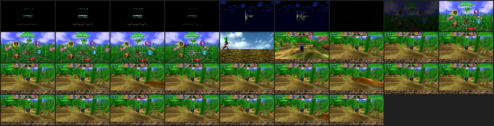

# Bugdom

_Generated by `orbistoun-cli compat markdown` from `compat/BUGD00001/report.toml`. Do not edit by hand; re-run it._

| | |
|---|---|
| Identifier | `BUGD00001` |
| Title id | `BUGD00001` |
| Name | `Bugdom` |
| Content version | `01.00` |
| Master version | `01.00` |

## How far it gets

| | |
|---|--:|
| Reach | presented |
| Outcome | ran to the time limit |
| Distinct imports | 55 |
| Answered by an implementation | 46 |
| Calls | 115754224 |
| Standing | 100% |
| Frames to the output layer | 2097 |
| Measured on | 2026-09-28 |
| On hardware | _unknown - nobody has attested it_ |
| Link plan | `9f7f3056cdba0a6b` (match) |

This is a run of the emulator as it stands.

## Frames



A frame every 60 flips, in order, from the reproduction below.

## Reproduce

```text
orbistoun-cli compat reproduce BUGD00001
```

| | |
|---|---|
| Title build | `02f32873772f7e74b474cd1b0004a829e3f0b9a867ab05d9452ecf7a03e60ca1` |
| Limit | 60 s |
| Frame kept | every 60 flips |
| Input | [`inputs.toml`](../../compat/BUGD00001/inputs.toml) |
| Clock | logical (D582, D735) |
