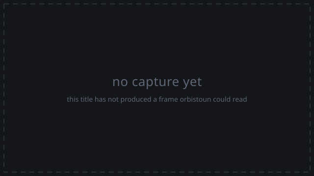

# Grand Theft Auto V

_Generated by `orbistoun-cli compat markdown` from `compat/PPSA04263-app0.toml`. Do not edit by hand; re-run it._

| | |
|---|---|
| Identifier | `PPSA04263-app0` |
| Title id | `PPSA04263` |
| Name | `Grand Theft Auto V` |
| Content version | `01.010.002` |
| Master version | `01.00` |

## How far it gets

| | |
|---|--:|
| Reach | entered |
| Outcome | image+0x196b91a |
| Distinct imports | 71 |
| Answered by an implementation | 64 |
| Calls | 30262 |
| Standing | 100% |
| Frames to the output layer | 0 |
| Measured on | 2026-09-15 |

This is a run of the emulator as it stands.

## Captures

**Menu** - not captured yet.

**Gameplay** - not captured yet.

