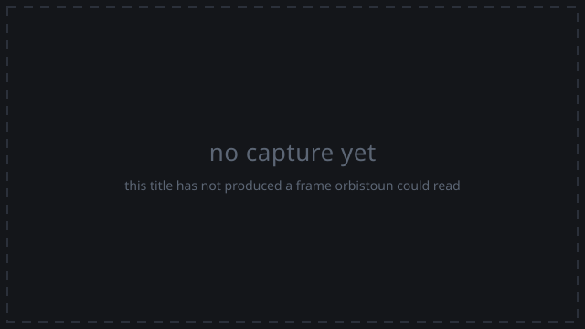

# payloads

_Generated by `orbistoun-cli compat markdown` from `compat/payloads.toml`. Do not edit by hand; re-run it._

| | |
|---|---|
| Identifier | `payloads` |
| Metadata | _none - this guest ships no `sce_sys/param.json`_ |

## How far it gets

| | |
|---|--:|
| Reach | entered |
| Outcome | ran to the time limit |
| Distinct imports | 39 |
| Answered by an implementation | 39 |
| Calls | 177966 |
| Standing | 100% |
| Frames to the output layer | 0 |
| Measured on | 2026-09-27 |
| On hardware | _unknown - nobody has attested it_ |
| Link plan | `65f6a59fe52eac13` (match) |

This is an experiment - a run resting on an answer nothing measured.

## Captures

**Menu** - not captured yet.

**Gameplay** - not captured yet.

